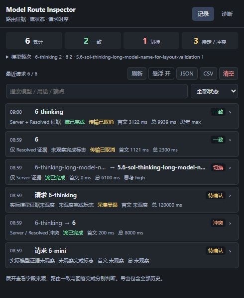
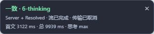
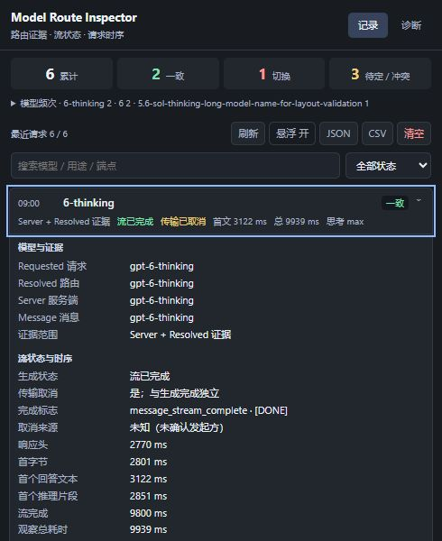
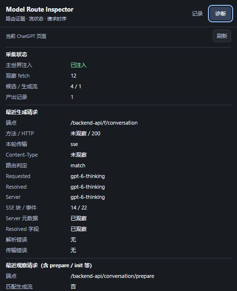

# Model Route Inspector

观察 ChatGPT 每轮请求与响应中的**模型路由元数据、流完成状态和请求时序**，在回复底栏、页面悬浮卡与扩展弹窗中查看，并保留可导出的本地历史。

插件分别记录 Requested、Resolved、Server 和 Message 模型。实际模型缺失时保持未知，不用请求模型补齐；模型名称不一致时标记“切换”，不推断切换原因。

> 这里的证据来自客户端收到的字段，例如 `resolved_model_slug` 和 `server_ste_metadata.metadata.model_slug`。它能帮助核对可见路由变化，不能证明服务器实际加载的模型权重，也不能仅凭模型名称变化确认“降级”。

原生 JavaScript / HTML / CSS，Manifest V3，无构建步骤。当前 manifest 版本为 **0.1.0**；README 更新不代表新版本发布。最低 Chrome 版本为 **111**，Chrome 已做真实网页验证，Edge 尚未实测。

[安装与更新](#安装与更新) · [使用](#使用) · [如何读懂证据](#如何读懂证据) · [开发与测试](#开发与测试)

## 界面预览

以下图片均来自当前源码的**本地合成预览**，使用合成模型字段和记录，用于说明界面；其中的切换、冲突与取消案例不代表真实服务端降级结果。



历史默认显示摘要，展开一条记录后再加载详情。累计模型频次可单独展开，较长模型名保留完整提示。

## 安装与更新

安装无需 Node、pnpm 或任何依赖。

1. 在 [GitHub 仓库](https://github.com/black-zero358/model-route-inspector) 选择 **Code → Download ZIP** 并解压，或克隆仓库。
2. Chrome 打开 `chrome://extensions/`；Edge 打开 `edge://extensions/`。
3. 启用**开发者模式**，点击**加载已解压的扩展程序**。
4. 选择直接包含 `manifest.json` 的目录。
5. 打开或刷新 `https://chatgpt.com/`，从扩展菜单打开 Model Route Inspector。可将其固定在工具栏。

开发者模式安装不会自动从 GitHub 更新。更新时用新文件替换原目录（Git 克隆可在确认本地改动后执行 `git pull`），在扩展管理页点击插件的**重新加载/刷新**，然后刷新已打开的 ChatGPT 页面。

## 使用

### 回复底栏与更多

每条能够精确关联的 Assistant 回复，在原操作按钮旁显示实际模型、思考强度、首 token 和总耗时。模型徽章只显示名称：一致使用浅绿色，模型切换或证据冲突使用浅红色；状态和请求/实际模型证据保留在鼠标提示与无障碍标签中。实际模型缺失或关联不明时显示中性提示。

**更多**在按钮旁展开同层小信息窗，显示本次响应观察到的工具名称、次数、状态和耗时。可再次点击按钮、点击窗外或按 Escape 收起。它不锁定页面，也不把未知工具次数显示为零。当前工具名称来自明确的 Assistant 工具接收方或服务端工具摘要；一次调用可能返回多条工具消息，因此不会按工具返回消息数推算次数。没有明确计数或耗时证据时显示 `Null`；仅观察到名称时状态为“已观察”，不推断为执行成功。列表不代表完整调用链。

信息窗按可见视窗与会裁剪祖先容器的交集定位，避让页面底部输入区及其覆盖背景，内容过长时在窗内滚动。右侧空间不足或窄屏时，信息窗占用底栏下方的正常布局空间；打开时按需要滚动对话一次，不通过提高层级覆盖输入区。锚点滚出可见区域或剩余高度不足时自动收起。

思考强度保留原始英文值（如 `max`），优先显示响应中声明的 `thinking_effort`；只有请求证据时标为“请求思考”。底栏缺失值显示 `Null`，即时模式不会被补写为 `none`。显示占位不改变 JSON 中的实际 `null` 与缺失状态；这些字段不证明服务器内部实际推理量。

底栏通过安全消息 ID 与会话范围关联具体回复，不按最后一条回复或时间顺序猜配。当前 ChatGPT 页面使用请求中的用户消息 ID 作为 `data-turn-key`，插件在本地保留最少必要关联 ID；请求包含多个用户消息、页面缺少稳定定位键或多条回复无法区分时不猜绑。同一输入发生多次生成，而网页没有暴露具体 Assistant 分支 ID 时，显示中性的“模型未确认”，关联待确认原因放在提示中，不选最新请求充当当前分支。刷新后的历史也必须满足同样的关联条件，旧记录缺少关联字段时可能不显示底栏。

重生成请求可能使用 `action=variant`、空 `messages` 和 `parent_message_id`。插件单独保留请求动作与请求父 ID；只有父 ID 精确匹配页面当前轮键或本地已知消息映射时才撤下旧结果，不将父 ID 假称为新用户输入。分支未明确时保留中性关联提示。

此前保存的记录可能缺少请求动作契约，无法判断是否漏掉过重生成关联。历史恢复在现代 `data-turn-key` 页面上对这类记录显示中性提示，不恢复具体模型和时长；页面若提供精确 Assistant 分支 ID，仍可按该 ID 关联。

### 悬浮卡与历史

在 ChatGPT 正常发送消息。确认是生成流后，观察到流结束、取消或采集达到限制时，页面右下角显示本轮摘要，后台保存安全元数据。



- **悬浮卡**显示模型证据、完成标志、传输取消、首个回答文本和观察总耗时。关闭后可在扩展弹窗中重新开启。
- **记录页**显示最近请求，默认按时间倒序。搜索支持模型、用途、端点、思考强度和工具名，也可按“一致 / 切换 / 冲突 / 待确认”筛选。
- **详情**先展示四种模型、流状态与时序，其余模式、调度、传输、追踪和字段来源分组折叠。用鼠标点击或键盘 Tab、Enter/Space 展开。
- **刷新**重新读取本地历史。如果出现“历史保存失败”，卡片只代表本页观察，应检查扩展连接；不能据此认为记录已入库。

历史保留最近 **1000 条**，统计累计自上次清空。因此超过1000轮后，累计数可能大于历史条数。顶部“待定 / 冲突”合并显示两类数量，筛选可分别查看。模型频次优先计入 Server → Resolved → Message，缺失时计入请求模型或兼容字段；频次本身不证明实际模型已被观察。



### 诊断

在当前 ChatGPT 标签页打开扩展的**诊断**页并刷新。先看主世界注入、观察 fetch 数、候选/生成流数和产出记录数，再查看两组请求：

| 诊断区域 | 用途 |
|---|---|
| 最近生成请求 | 查看确认过的生成端点、HTTP、传输、模型、SSE块/事件数与错误 |
| 最近观察请求 | 查看最近候选请求；可能是 prepare 或 init，不应当作上一组生成结果 |
| 未识别 metadata | 显示安全字段名与类型，不保存对应值 |

没有记录时，先确认当前标签页是 ChatGPT，扩展已重新加载且网页已刷新。普通 JSON 请求仅带有模型名，不足以确认它是生成流。

脚本在 `document_start` 运行，此时 HTML 根节点可能尚未出现：消息桥接先注册，底栏观察和页面卡片延后到 DOM 可用时启动，界面初始化异常不应阻断本地历史保存。HTML 上的 `data-mri-content-version`、`data-mri-content-ready`、`data-mri-inline-ready` 仅提供固定实现标记和桥接/底栏初始化布尔状态，不包含聊天或路由数据。这些页面属性可被修改，不能证明服务器身份、扩展完整性或每条底栏均已挂载；应结合扩展诊断、实际请求与入库结果核对。



### 导出与清空

- **JSON**保留安全元数据、`fieldSources`、`fieldStates` 和累计统计，适合核对原始字段状态。
- **CSV**提供61列的扁平记录，适合表格分析；不完整表达来源与字段状态。新增请求 ID、输入与 Assistant 关联 ID、响应父消息 ID、请求动作及请求父 ID、请求思考强度、首 token 时间与来源、工具证据及工具列表；关联 ID 数组和工具列表使用 JSON 字符串保留结构。以 `= + - @` 等公式前缀开头的值添加单引号，避免作为电子表格公式执行。
- 导出包含**全部保留历史**，不受当前搜索或筛选影响。
- **清空**经确认后同时删除历史并重置累计统计。记录、设置、清空与导出按收到的顺序排队；写入失败会显示错误，不返回假成功。

## 如何读懂证据

### 模型与判定

| 字段 | 来源 |
|---|---|
| Requested | 请求体的 `model` |
| Resolved | 响应里的 `resolved_model_slug` |
| Server | `server_ste_metadata.metadata.model_slug` |
| Message | Assistant 消息的 `metadata.model_slug`；兼容旧 `message.model` |

字段各自保留，不互相填补。例如只有 Resolved 时，界面显示“仅 Resolved 证据”，不会宣称已观察 Server。详情中的字段来源可用于核对解析位置。

| 状态 | 含义 |
|---|---|
| 一致 `match` | Requested 与已观察的实际模型一致 |
| 切换 `mismatch` | Requested 与已观察的实际模型不同，原因未确认 |
| 冲突 `conflict` | Resolved 与 Server 同时存在且名称不同 |
| 待确认 `unknown` | 请求或实际模型缺失，无法完成比较 |

判定先检查 Server / Resolved 冲突，再依次使用 Server → Resolved → Message 与 Requested 比较。模型名按返回值比较，不猜测别名或隐藏路由。

### 空值、缺失与派生提示

| 显示 | 含义 |
|---|---|
| 明确 null | 确实观察到字段，其值是 `null` |
| 未观察 | 本轮没有取得该字段，或旧记录没有状态信息 |
| 空值 / 空列表 | 观察到空字符串或 `[]` |
| 类型异常 | 字段类型不符合白名单，原值未保留 |
| 不适用 / 派生检测 | 根据其它明确字段产生的说明，原字段状态仍单独保留 |

例如 `turnUseCase=search` 可以产生“检测到搜索”的提示，但不会把 `isSearch=null` 改写为 true。`resumeWithWebsockets=true` 仅说明支持 WS 恢复，不表示本轮使用 WebSocket。

### 完成与取消

**路由一致不等于回答完成。** 插件只有观察到有效的 `[DONE]` 或 `message_stream_complete` 才标记 `streamComplete=true`。没有完成标志时显示“未观察完成标志”，不推断为成功或失败。

`transportCanceled`（兼容旧 `aborted`）记录观察分支的传输取消，可与流已完成同时为 true。`cancelReason=unknown` 表示未确认发起方；插件不会仅凭取消错误断定用户点击了停止。观察器超时或事件/结构超限单独显示“采集受限”，不当作用户停止或生成完成。

## 时序指标

新版浏览器指标统一从**发起 fetch 前**计时，单位为毫秒，界面四舍五入显示。它们是到不同观测时点的累计时长，不应逐项相加。

| 界面 / JSON字段 | 观测时点 |
|---|---|
| 响应头 `responseHeadersMs` | fetch 返回 Response |
| 首字节 `firstByteMs` | 观察副本读到首个非空数据块 |
| 首个回答文本 `firstTextMs` | 首个回答文本片段 |
| 首个推理片段 `firstReasoningMs` | 首个推理片段；不保存推理正文 |
| 底栏首 token `firstTokenMs` | 首个可关联到本轮 Assistant 的文本或首 token 标记，以先出现者为准 |
| 流完成 `completionMs` | 首个有效完成标志 |
| 观察总耗时 `totalMs` | 观察分支结束或取消、受限退出 |
| 兼容指标 `firstDeltaMs` | 首个回答文本或推理片段，以先出现者为准 |

`timingSource` 通常为 `performance.now`，不可用时降级为 `date.now`。服务端 TTFVT、推理开始/结束和完成耗时来自独立服务端字段，不与浏览器等待相加。旧记录若没有计时来源，会注明“计时起点未确认”。

底栏首 token 从请求开始计到**客户端收到**本轮 Assistant 正文、推理文本或首 token 标记的时点，不是服务器内部生成 token 的精确时刻，也不等同于响应首字节。`firstTokenSource` 区分 `assistant.text`、`assistant.reasoning`、`marker.user_visible` 与 `marker.reasoning`；鼠标提示说明来源。先出现推理证据时，数值可能早于最终答案首文本。标记先于消息快照到达时，只有确认消息属于当前生成或沿父消息链精确关联到当前唯一用户输入后才采用；无法确认则保持未观察。

## 隐私与权限

历史只保存本地 `chrome.storage.local`，插件没有上传历史的接口。已知字段按类型和长度白名单净化；URL去除 query/hash并限定安全端点。未知 metadata 只保留安全名称与类型。

不保存用户输入、Assistant回答、System Prompt、推理正文、图片像素、完整SSE正文、Cookie、认证头、Access Token 或恢复令牌。安全元数据仍可能包括会话、消息与请求追踪ID，分享导出前应自行检查。

| 权限 / 范围 | 用途 |
|---|---|
| `storage` | 本地历史、累计统计与悬浮卡设置 |
| `notifications` | 模型切换且不同于上一轮实际模型时通知 |
| `https://chatgpt.com/*`、`https://chat.openai.com/*` | 在目标页面观察请求、显示悬浮卡与读取诊断 |

历史限制可信扩展上下文直接访问；后台验证消息发送者与用途，桥接和存储两层过滤数据。网页 MAIN world 的观察值仍可被页面伪造，消息标记与字段来源不构成服务器身份认证。

## 工作原理

```text
网页 fetch → 筛选候选请求 → 读取 response.clone() 的副本
           → 增量解析 SSE、确认生成流 → 提取安全模型与状态
           → ISOLATED content bridge → 后台排队保存 → 弹窗历史/导出
```

每个请求独立保存状态，prepare、init、stop不覆盖生成记录的端点与结束时间。当前真实观察到的主接口是 `POST /backend-api/f/conversation`，保留旧 conversation 路径兼容，并通过响应结构再次确认生成流。

观察副本不消费网页原响应，不修改网页的请求取消信号。解析和读取设置事件大小、结构深度、识别前读取与空闲时间上限；触发限制时结束观察副本并标记受限。EOF处未正确分隔的SSE兼容提取不会被当作完成证据。

## 开发与测试

运行测试需要 Node.js 和 pnpm；扩展本身无构建依赖，仓库的私有 `package.json` 仅提供测试和预览入口，不发布npm包，无需安装依赖。在包含 `manifest.json` 的**仓库根目录**执行：

```bash
pnpm test
```

也可以分别运行七套检查：

```bash
pnpm exec node test/run-tests.js
pnpm exec node test/regression-test.js
pnpm exec node test/integration-test.js
pnpm exec node test/core-regression.js
pnpm exec node test/storage-regression.js
pnpm exec node test/ui-contract.js
pnpm exec node test/inline-ui-regression.js
```

裁剪边界修复后，这七套自包含检查的最终独立复验共 **330项通过**（51 + 47 + 35 + 78 + 33 + 30 + 56），覆盖SSE分块、现代补丁与模型来源、完成/取消、原响应保持可读、并发存储与失败恢复、字段净化、底栏精确关联、重生成与旧历史恢复，以及同层信息窗、祖先裁剪交集和输入区避让。核心回归附带六场景安全协议fixture与当前搜索流的独立安全结构投影，不依赖仓库外的报告或证据目录；存储测试使用模拟Chrome API，不能代替真实浏览器验收。

本地兼容性验证工作区另有32项诊断回放，连同上述七套最终共 **362项通过、退出码0**，`git diff --check` 同样通过。这32项依赖工作区中的诊断脚本，与插件自包含的330项分开记录。此前桌面截图曾因祖先容器裁剪只显示信息窗窄条，该次视觉FAIL保留；修复后桌面当前画面与360px窄屏首次打开的信息窗均经实际像素视检，内容完整且避让输入区。合成像素检查与尺寸断言分开记录，均不证明最终版已在真实聊天中加载。

合成界面预览：

```bash
pnpm preview
```

打开 `http://127.0.0.1:4173/popup` 查看历史，`/card` 查看悬浮卡；`/intrinsic` 检查从200px起始的自动尺寸宿主，`/responsive?width=360` 检查普通窄视窗。按 Ctrl+C 结束服务器。所有预览记录均为合成数据。`/baseline` 对照需要Git历史中的原始 `a3f2d82` 提交；ZIP或浅克隆缺少它时，对照明确返回不可用，当前预览仍可使用。

```text
manifest.json       扩展入口与权限
package.json        无依赖的私有测试/预览入口
src/parser.js       增量SSE解析
src/detector.js     安全字段提取与路由判定
src/injected.js     MAIN world请求观察与诊断
src/content.js      ISOLATED桥接与悬浮卡
src/inline-ui.js    回复关联、底栏与同层信息窗
src/background.js   存储队列、消息边界与导出
src/popup.*         历史、筛选、详情与诊断
test/               自包含回归与合成预览
docs/images/        README合成界面截图
```

## 验证范围与限制

本轮新增回复底栏、同层“更多”信息窗与关联字段，已完成安全结构回放、模拟存储和合成页面检查。用户重载后完成普通文本、搜索、无工具回答、即时模式、停止与重生成六场景在线观测：前五场景取得底栏与安全 Network 证据，旧 R6 重生成场景发现旧底栏未撤下的失败，该历史失败保留。

据真实空输入 variant 结构修复关联、历史恢复和裁剪边界后，用户再次重载并完成 R7–R9：R7 请求/响应均为 `max`，底栏保留英文；R8 请求父 ID 精确对应 R7 输入，生成中撤下旧值，完成后显示中性关联提示并禁用工具按钮；R9 即时模式请求与响应缺少强度，底栏显示 `Null`。真实“更多”窗的完整显示及输入区避让已确认。用户提供的实际 JSON 共37条，本轮9条均按安全 ID 哈希、会话与请求时间唯一匹配，观察到的模型/元字段无差异；安全投影未覆盖的字段继续未验证，不补期望。导出中的首 token/总耗时与页面舍入显示兼容，不声称与 Network 内部时钟精确等同。本轮未取得实际 CSV 下载，JSON/CSV字段映射属于离线回归。以下4轮和两次导出结果属于此前修复版，分别保留。

2026-10-08，修复版在Chrome中完成4轮真实GPT-6测试，包括新聊天首轮、主动停止和两独立标签并发。用户两次实际JSON/CSV下载均包含15条记录（旧11条与新4条），本轮字段、统计和导出映射已核对；最终真实弹窗尺寸与单滚动布局已确认。并发两流取消后的响应正文未取得，不把卡片字段当作独立Network完成标志对照。

- ChatGPT Web属于内部协议，接口和字段可能变化；缺少关键证据时保持未知。
- 当前主要监听 `window.fetch`。Work、WS-only传输与Edge尚未验收；WS恢复能力字段不意味着已实现WS-only捕获。
- 更多图片格式、真实服务端降级、浏览器整进程或独立worker重启持久化仍未验证。现有结构回放、合成UI和模拟重启不代替这些验收。
- 原始版的在线结果与修复版分开记录。所有模型字段都是客户端可见证据，不能证明模型权重身份。
